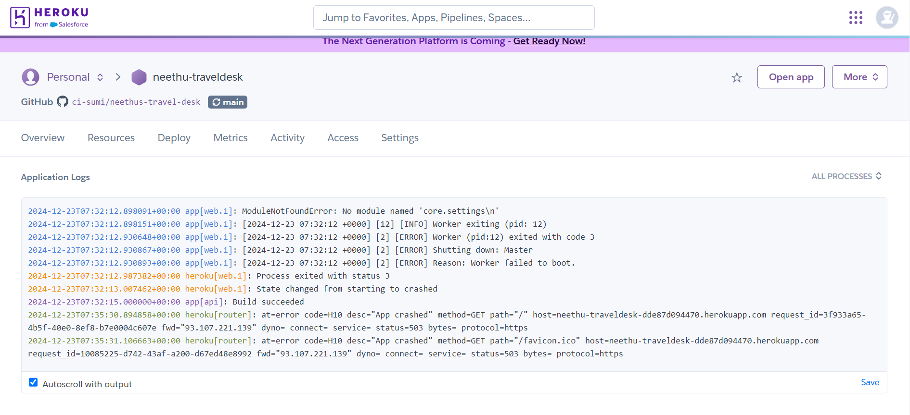

# Neethus Travel Desk
[](https://neethus-travel-c40ea47fdf43.herokuapp.com/)


***Important Note***
This project was initially structured in a way that caused errors during deployment, particularly on Heroku. Due to these issues, the original deployment on Heroku resulted in an Application Error.. After troubleshooting, it was determined that the project structure needed to be reorganized for better compatibility with deployment platforms.

To address this, the entire project has been restructured and redeployed successfully on Heroku using a new GitHub repository.https://github.com/ci-sumi/test-deploy-neethu-s-travel-desk.

For project validation and reference:
1. This Repository (Old):
This repository is retained specifically for the README file and historical reference. It contains the original project structure, which is not recommended for deployment.
Current GitHub Repository (https://github.com/ci-sumi/neethus-travel-desk).
2. New Repository (Updated and Functional):
The updated and corrected version of the project, which is fully functional and deployment-ready, is hosted in a new GitHub repository.[New GitHub Project Link.](https://github.com/ci-sumi/test-deploy-neethu-s-travel-desk.)


## Table of Contents


[NeethusTravelDesk](#Neethus-Travel-Desk)
* [Tabele of Contents](#table-of-contents)
* [Indroduction](#introduction)
* [User Stories](#user-stories)
* [UX](#ux)
  + [Typography](#typography)
  + [Wireframes](#wireframes)
* [Accessibility](#accessibility)
* [Database Design](#database-design)
* [Features](#features)
* [Existing Features](#existing-features)
* [Future Features](#future-features)
* [Issues and Bugs](#issues-and-bugs)
* [Technologies Used](#technologies-used)
* [Testing](#testing)
* [Deployement](#deployement)
  + [Local Deployement](#local-deployemnt)
  + [Heroku Deployement](#heroku-deployemnet)
* [Credits](#credits)
  + [Content](#content)
  + [Media](#media)
* [Ackowledgements](#acknowledgements)


## Introduction
Neethu's Travel Desk is the fourth portfolio project of the Code Institute's Full Stack Web Development course. This website is a fully developed, full-stack platform built using Python 3.11.2 and Django 4.2, with a MySQL 8.0 database. The static files are hosted on Cloudinary, and the website is deployed on Heroku for easy access and management.

The website is designed as a travel community platform where users can share details of their favorite travel destinations, including the best times to visit. In addition, users can calculate the estimated travel expenses for the destinations they share using the integrated Travel Budget Calculator. This feature allows users to input their travel preferences and get an approximate budget, helping them plan their trips more effectively within their financial means.

The idea for this website came from my friend Neethu, who owns a travel agency. While her business is growing, Neethu wanted to create a platform where travelers could come together to share their travel experiences and get inspiration for their future trips.

This website serves as a strong foundation for future enhancements. The aim is to evolve it into a fully functional travel service platform where users can not only plan their trips but also make bookings, find exclusive deals, and get personalized travel recommendations.

Key Features
Travel Destination Sharing:
Users can share details of their favorite travel destinations, including the best times to visit.

Travel Budget Calculator:
An integrated tool to estimate travel expenses based on user preferences.

Community Platform:
A space for travelers to connect, share experiences, and get inspired for future trips.

Future Enhancements:
Plans to add booking functionality, exclusive deals, and personalized travel recommendations.

Technologies Used
Frontend: HTML, CSS, JavaScript, Bootstrap

Backend: Python 3.11.2, Django 4.2

Database: MySQL 8.0

Static Files Hosting: Cloudinary

Deployment: Heroku


## User Stories
1. As a ***new user***, I want to ***register for an account on the "Neethu's Travel Desk" website***, so that I can ***access the platform with username or email,and password***.

2. As a ***registered user***, I want to ***edit my profile information***, so I ***can update my personal details, including my profile picture, password, and email address.***

3. As a ***registered user***, I want to be able to ***delete my account*** so I can ***remove my profile and all related data from the platform if I decide to leave.***

4. As a ***registered user***, I want to ***add a new travel destination to the website***, so that ***others can see and learn about the places I recommend.***

5. As a ***registered user***, I want to ***update the details of the travel destinations I have shared***, so I can ***correct or add new information, such as the place name, country, description, best time to visit, budget, image, and mark it as a favorite.***

6. As a ***registered user***, I want to ***delete a travel destination from my profile***, so that ***it is no longer visible on the platform.***

7. As a ***registered user***, I want to ***use the Travel Budget Calculator to estimate the expenses for my trip to any destination shared on the website***, so that ***I can plan my budget effectively and view the approximate costs.***

8. As a ***registered user***, I want to ***see a list of all the destinations I have shared*** so I can ***easily refer to the places I’ve contributed to the website.***

9. As a ***registered user***, I want to be ***able to click the heart button to mark a place as a favorite***, so that I can ***easily keep track of the destinations I love.***

10. As a travel enthusiast and a ***registered user***, I want to ***search for destinations shared by other users***, so I can ***discover new places to visit and plan my own travels.***

11. As a ***registered user***, I want to be ***able to click the like button to show my appreciation for a destination***, so that ***I can express my interest in the places I enjoy.***

12. As a ***registered user***, I want to ***contact the website administrators through a contact form,*** so I can ***ask questions, share feedback, or request support regarding the platform.***

[Back to top ⇧](#table-of-contents)

## UX

### Development Planes
#### Strategy
- **Objective**  Create a user-centric platform that encourages users to share and explore travel destinations, fostering a community of travel enthusiasts. Provide tools such as a Travel Budget Calculator to enhance the user experience.

- **User Research** Conduct surveys and user interviews to understand the needs, preferences, and pain points of both casual travelers and dedicated travel enthusiasts.

- **Competitor Analysis** Analyse similar platforms to identify gaps and opportunities in the market, particularly focusing on travel community platforms and budget planning tools

- **Persona Creation** Develop user personas representing various types of users, including new visitors, registered users, and passionate travelers.

- **Goals** Define measurable goals, such as increasing user engagement, encouraging destination sharing, and improving the utility of the Travel Budget Calculator.

##### Target Audience
**Roles:**
- New Users (unregistered)
- Registered Users
- Travel Enthusiasts
- Administrators
**Demographics:**
- Desire to travel
- Desire to share experiences
- Budget-conscious individuals
- Travelers of all ages

**Psychographics:**
- Personality & Attitudes:
- Curious
- Adventurous
- Budget-conscious

**Values:**
- Exploration
- Planning and organization
- Community

**Lifestyles:**
- Interested in travel
- Value sharing experiences
- Open to discovering new destinations

##### User and Client Needs

| User Needs                    | Client Needs                              |
|:----------------------------- |:----------------------------------------- |
| Register/Login to account     | Provide a travel destination database     |
| Search for travel destinations| Log into administrator account for platform management |
| View destination details      | Use website for personal or professional purposes |
| Use the Travel Budget Calculator | Monitor user engagement             |
| Like or favorite destinations |                                           |
| Contact the administrator     |                                           |

##### Importance/Viability Tables


[Back to top ⇧](#table-of-contents)

#### SCOPE
- **Features:** User registration, profile management, destination addition, editing and deletion, liking destinations, viewing user-added destinations, a favorites page, and a travel budget calculator.

- **Content:** The platform will contain user-shared travel destinations with details like the destination name, country, best time to visit, budget type, descriptions, and images.

- **User Flow:** Users will be able to register for an account, log in, share destinations, edit and delete destinations, like destinations, mark them as favorites, calculate travel budgets, and manage their profiles.

- **Technical Requirements:**
Front-End: HTML, CSS, JavaScript, Bootstrap 5, Font Awesome
Back-End: Python, Django 4.2, MySQL Database
Deployment: Hosted on Heroku, with static files stored on Cloudinary. Version control will be managed using Git and GitHub.
Milestones:
The project is divided into milestones and tasks, managed via GitHub Projects:

MVP Release
User Profile Enhancements
Final Project Refinement

##### Content Requirements
- Content (text, images): Destination details, budget planner inputs, and travel tips.
- The User will look for:
  - Customizable account settings
  - The ability to share, modify, and delete travel destinations
  - Marking destinations as favorite
  - Estimating travel costs using the budget planner
- Design Considerations:
  - Easy and intuitive navigation
  - A visually appealing theme (typography, imagery, color palette)

- Destination Detail Page:
  - Name
  - Country
  - Image
  - Description
  - Best Time to Visit
  - Budget Type
  - Favourite
##### Functionality Requirements:
The user will be able to:
- Register for an account
- Log in to their account
- Log out of their account
- Add a travel destination with:
  - Name
  - Country
  - Best Time to Visit
  - Budget Type
  - Description
  - Image
- Edit shared destinations
- Delete shared destinations
- Like a destination
- Mark a destination as favorite
- View a list of their favorite destinations
- Use the Travel Budget Calculator to estimate trip expenses
- View a list of destinations they have shared
- View all shared destinations by other users
- View detailed destination pages
- Manage their profile:
  - Update personal information
  - Delete their profile
- View a custom 404 error page

[Back to top ⇧](#table-of-contents)

#### STRUCTURE
- *** Interaction Design: ***
  Users will interact with the website using common devices like a mouse, keyboard, and touchscreens. Input forms and buttons will provide clear feedback for user actions.
- *** Information Architecture: ***
  The website will be organized into intuitive categories, including Home, Explore Destinations, Add Destination, Budget Planner, Profile, and Favorites.
  The most important information, such as shared destinations and budget tools, will be prominently displayed for easy access.
- *** Navigation: ***
  - A consistent navigation bar will be available across all pages, featuring links to Home, Destinations, Add Destination, Budget Planner, Profile, and Logout (for logged-in users).
  - The design will ensure accessibility and responsiveness across different screen sizes.
- *** Information Design ***
  - Destination details and user-generated content will be displayed in an engaging and visually appealing manner, with clear labels, images, and organized layouts.
  - Important features like the budget calculator will use simple forms and clear instructions for usability.
- **** Interface Design: ***
  - The interface will prioritize clarity, simplicity, and responsiveness.
  - A cohesive design will be maintained with consistent color schemes, typography, and layout across desktop, tablet, and mobile devices.
  **Information Architecture and Navigation**
  

  [Back to top ⇧]
#### SKELETON
- **Wireframes:** The wireframes for the website were designed using Balsamiq to outline the layout and functionality across various devices, including desktop, tablet, and mobile. These wireframes provide a visual representation of the following key pages:
- - Home Page: The main landing page for users.
- - Register Page: Where new users can create an account.
- - Login Page: For existing users to access their account.
Profile Page: Displays user-specific information and settings.
- - Add Destination Page: Allows users to share a new travel destination.
- - Edit Destination Page: Enables users to modify their shared destination details.
- - Delete Destination Page: For users to remove their shared destinations.
- - Destination Details Page: Displays detailed information about a specific destination.
- - Favourites Page: Showcases a user’s marked favourite destinations.
- - User Shared Destinations Page: Lists all destinations added by the user.
- - Contact Page: Provides a form for users to contact the site administrator.
[Link to Wireframes](core/docs/wireframes/neethus_traveldesk.pdf)

#### SURFACE
##### Colour Scheme

The color scheme for Neethu's Travel Desk was inspired by a Cornflower Palette, combining soft and vibrant tones that align with the themes of travel and exploration. The following colors were used consistently across the website:

- - Cornflower (#8dcfec) – Evoking a sense of calm and trust, used in backgrounds and sections.
- - Rose (#ef0673) – Adding energy and vibrancy, applied to buttons and key highlights.
- - Ebony (#090d17) – Representing elegance and strength, used for primary text and contrasting elements.
This palette ensures the website remains visually appealing and cohesive while enhancing readability and accessibility. Standard Bootstrap colors were also incorporated to ensure compatibility and consistency with the framework.


Certainly! Here's a rewritten version of the Typography section for your README file in the style you requested:

##### Typography
Montserrat Alternates is used for the logo and headings to give the website a clean, modern, and professional look.
Roboto Serif is used for the body text to ensure readability and a polished, professional feel.
Mooli is used for the destination names to add a unique and playful touch.
All fonts are sourced from Google Fonts.[Google Fonts](https://fonts.google.com/).
##### Imagery
The images used on the website were sourced from Unsplash, a platform offering high-quality, free-to-use images. Additionally, some images were obtained from Google Images for specific content. For more detailed attribution, please refer to the Credits section.
##### Branding
A simple yet stylish logo was created to reflect the essence of "Neethu's Travel Desk." The logo is designed with a focus on sleek, modern typography that is easy to remember and recognize, representing the brand name, "Neethu's Travel Desk." The logo was crafted using favicon.io, an online logo and favicon generator.
[Back to top ⇧](#table-of-contents)
##### Wireframes
##### Prototypes
Given the time constraints, the website was not prototyped. The website was built using the wireframes as a guide.

##### Feedback and Iteration
Generally, the developer relied on the feedback from the mentor and the peer-code review to improve the website. The developer also relied on the feedback from some other users to improve the website. The constant changing of the website functionalities and design was a result of the feedback received.

[Back to top ⇧](#table-of-contents)

## Accessibility
The website adheres to recognized accessibility standards to ensure a seamless experience for all users. To validate its accessibility, Lighthouse Validation was utilized to assess the site for any potential issues. As a result, the website is fully optimized for accessibility, providing an inclusive browsing experience.

## Database Design
The database design was created using QuickDBD. The database is hosted on MySQL.

The database design for Neethu's Travel Desk was created using Django models. The models are structured to manage user data, destinations, budget calculations, and contact information efficiently. Here's an overview of the models:

- ** Contact Model **
The Contact model is used to store contact information submitted by users. It includes the user's name, email, phone number, and their message. Additionally, the time_stamp field records when the contact was created.

Fields: name, email, phone_number, contact_message, time_stamp.
UserProfile Model:
The UserProfile model extends the default Django User model and stores additional user profile details such as their profile picture. This model allows a user to have a personalized profile image.

Fields: user (OneToOne relationship with Django's User model), profile_picture.
Destination Model:
The Destination model stores information about various travel destinations. Each destination includes details such as the destination name, country, a short description, the best season to visit, budget type, an image, and favorite/like features. The model also allows users to mark destinations as favorites or liked.

Fields: name, country, description, best_time_to_visit, budget_type, image, is_favorite, user, favorites, likes.
The model includes a method total_likes to calculate the total number of likes for each destination.

BudgetCalculator Model:
The BudgetCalculator model allows users to calculate the estimated cost of a trip based on various inputs, such as accommodation cost, transportation cost, food cost, activity cost, and the number of adults and infants traveling. The model calculates the total cost based on these values.

Fields: destination (ForeignKey to Destination), accommodation_cost, transportation_cost, food_cost, activity_cost, number_of_adults, number_of_infants.
The total_cost method calculates the total trip cost based on the given costs and number of travelers.

Database Relationship:
UserProfile has a OneToOne relationship with the User model to extend user information.
Destination has a ForeignKey relationship to the User model, representing the user who created the destination listing.
Destination uses ManyToMany relationships with the User model for users' favorites and likes of destinations.
BudgetCalculator is linked to Destination via a ForeignKey, and calculates the total cost based on inputs.
[Back to top ⇧](#table-of-contents)
## Features 
### Existing Features
#### Navbar
The navigation bar is created using a Bootstrap template. On the left side, there’s a logo ("Neethu’s Travel Desk"), which is also a clickable link that directs users to the homepage. There is also a "Find Destination" link, leading to the page where users can search for destinations. The "Contact Us" link is also available in the navbar. The "Find Destination" link disappears if the user is not logged in.

On the right, the navbar features links for "Register" and "Login." Once a user logs in, these links are replaced with links to the "Profile" page (with a small profile picture icon) and a "Logout" button. Additionally, links such as "Add Destination," "My Destinations," and "My Favourites" are visible only to logged-in users. These links are responsive and collapse into a hamburger menu on smaller screens. If the user hasn’t uploaded a profile image, a default image is displayed.

Footer
The footer is styled based on a template from MdBootstrap Documentation. It includes social media links that open in new tabs and copyright information at the bottom. JavaScript is used to ensure the footer remains fixed at the bottom of the page.

Both the navbar and footer are consistent elements across all pages of the website.

Messages
The built-in Django messaging system is used to notify users about their actions. Messages are displayed at the top of the page, disappear after a few seconds, and are responsive to different screen sizes.

Homepage
The homepage features animations and images, along with a short description of the website. The animations are created using CSS and JavaScript, and the content is fully responsive. Additionally, the homepage includes buttons to navigate to the "My Destinations" and "Profile" pages.

Login/Register Pages
The login and registration pages are simple forms that allow users to log in or sign up. These forms are validated on both the client and server sides. After successful registration, the user is redirected to the "My Destinations" page. After logging in, the user is also redirected to the "My Destinations" page.

Contact Page
The Contact Page contains a contact form powered by EmailJS. The form is responsive, validated on both client and server sides, and sends an email to the developer once submitted.

Find a Destination Page
The "Find a Destination" page allows users to search for destinations. The form is HTML-based and controlled by a Django view. The search works based on criteria like destination title, country, and category. If the search field is not empty, a "clear search" button appears, which clears the search results. The results are sorted by the date of addition, and the table includes columns for destination name, country, and a "like" button. The table is responsive, and columns like the number and category disappear on smaller screens. Liked destinations are represented by a red solid heart, while unliked ones have a blue, shallow animated heart. Clicking on a destination title redirects the user to the destination details page.

Destination Details Page
This page displays all information related to a specific destination, including the name, description, image, best time to visit, budget type, and the number of likes. Users can like or unlike a destination, and the page contains a "Back" button to return to the previous page.

Add Destination Page
The "Add Destination" page is a form that allows users to add a new destination. Only the image field is optional. The form is validated on both the client and server sides. After submission, the user is redirected to the "My Destinations" page.

My Destinations Page
This page displays a table of destinations added by the user. The table is responsive, with columns for destination name, country, and a "like" button. The "like" button is animated, showing a red solid heart when liked and a blue shallow heart when unliked. Users can edit or delete destinations by clicking on the corresponding buttons next to each record. There’s also an "Add Destination" button that directs users to the "Add Destination" page.

Edit Destination Page
The "Edit Destination" page is a form pre-populated with the destination's existing data. The user can update details like name, description, budget, and image. The form is validated on both the client and server sides. After submitting the changes, the user is redirected to the "My Destinations" page.

Delete Destination Page
The "Delete Destination" page allows the user to confirm the deletion of a destination. If confirmed, the destination is deleted from the database, and the user is redirected to the "My Destinations" page. If canceled, the user is redirected back to the "My Destinations" page without any changes.

My Favourites Page
The "My Favourites" page shows a table of destinations the user has liked. It includes columns for the destination name, country, and a button to "unlike" a destination (represented by a red "X" icon). The table is responsive, with some columns hidden on smaller screens. At the bottom of the page is an "Add to Favourites" button that redirects to the "Find a Destination" page.

Profile Page
Users can access their profile by clicking on their profile image in the navbar or by clicking the "Profile" button on the homepage. The profile page displays the user's image, username, and email, along with two options: "Edit Profile" and "Delete Profile." Clicking "Edit Profile" redirects the user to the "Edit Profile" page, while "Delete Profile" prompts a confirmation modal. If confirmed, the user’s profile and associated destinations are deleted from the database, and the user is logged out.

Edit Profile Page
The "Edit Profile" page allows the user to change their email, password, and profile image. The form is pre-populated with the existing data, and the changes are validated on both the client and server sides. After submitting, the user is redirected back to the Profile page. If the password field is left empty, the password remains unchanged. If canceled, the user is redirected to the Profile page without any changes.

Custom Error Page
A custom 404 error page is created with Django. It displays a message and includes a large round image that changes from grayscale to color on hover. Clicking on the image takes the user back to the homepage.

#### Favicon
The favicon for the website is a flight-related design, symbolizing travel and exploration, which ties directly to the nature of the platform. This favicon was generated using the favicon.io tool and serves as a simple yet recognizable visual identifier for the website.

#### Future Features
Rich Text Editor for Descriptions: Initially, there was a plan to implement a rich text editor for destination descriptions, potentially using Summernote. This feature was not fully implemented yet, but there are plans to integrate it in the future to enhance the user experience with better formatting options for text.

Category Management: The idea was to create a dedicated page for managing categories, allowing users to add new categories. This feature would include a Many-to-Many relationship between the "Destination" and "Category" models. It is planned to be implemented in the future to allow users more flexibility in managing destinations based on categories.

User Contributions: There is a future plan to display details about the user who contributed a destination. This would involve showing user information on the destination detail page and creating a dedicated page where users can view all destinations by a specific user. This feature aims to enhance community interaction on the platform.

Administrator Access: The implementation of an administrator role with different access levels is planned. This would include better control over the deletion of destinations and users, preventing automatic deletions and making them subject to administrator approval. Additionally, administrators would have control over category management.

Pagination: Pagination is an important feature for improving the performance and usability of the website, especially on pages displaying large amounts of data, such as search results and user listings. Although this feature was not implemented due to time constraints, it is planned to be added in the future to enhance the browsing experience.

[Back to top ⇧](#table-of-contents)

## Issues and Bugs
- *Directory Structure*
    - **Issue:** The directory structure is not the best. The developer tried to make it as logical as possible, but there's a lot of room for improvement. The templates in the authors app are not following the ideal structure (/templates/app-name/...). Unfortunatelly, the developer realised that too late and didn't want to compromise the functionality of the website by changing the structure.
- *Application Error*
   This project was initially structured in a way that caused errors during deployment, particularly on Heroku. Due to these issues, the original deployment on Heroku resulted in an Application Error.
   After troubleshooting, it was determined that the project structure needed to be reorganized for better compatibility with deployment platforms.
 * Bug: Profile Update and Password Change Functionality

   * The profile update and password change functionality is not working as expected.


[Back to top ⇧](#table-of-contents)

## Technologies Used
### Main Languages Used
- [HTML5](https://en.wikipedia.org/wiki/HTML5)
   - The website is built using HTML5 to structure its content and ensure semantic markup.

- [CSS3](https://en.wikipedia.org/wiki/CSS)
    - The project uses **CSS3** to style the content of the website.
- [JavaScript](https://en.wikipedia.org/wiki/JavaScript)
    - The project uses **JavaScript** to add interactivity to the website.
- [Python](https://en.wikipedia.org/wiki/Python_(programming_language))
    - The project uses **Python** to create the backend of the website.

### Frameworks, Libraries & Programs Used
#### Front-End
- [Bootstrap 5](https://getbootstrap.com/)
    - The project uses **Bootstrap 5** to simplify the structure of the website and make the website responsive easily.
- [Google Fonts](https://fonts.google.com/)
    - The project uses **Google Fonts** to style the fonts of the website. The fonts used are "Montserrat Alternates", "Roboto Serif", and "Mooli".
- [Font Awesome](https://fontawesome.com/)
    - The project uses **Font Awesome** to add icons to the website.

#### Back-End
- [Django](https://www.djangoproject.com/)
- The project uses **Django** to create the backend of the website.
- [pip3 (Python Package Installer)](https://pip.pypa.io/en/stable/) 
    - The project uses **pip3** to install the necessary tools and libraries.
- [PostgreSQL](https://www.postgresql.org/)
    - **PostgreSQL** to create the database of the website.
- [ElephantSQL](https://www.elephantsql.com/)
    - **ElephantSQL** for hosting of the database of the website.
- [Heroku](https://www.heroku.com/)
    - **Heroku** for the website deployment.
- [Cloudinary](https://cloudinary.com/)
    - The project uses **Cloudinary** to store the images of the website.
- [Summernote](https://summernote.org/)
    - The project uses **Summernote** to create a rich text editor for the website. Although, this functionality wasn't entirely implemented in the final version of the website.
- [gunicorn](https://pypi.org/project/gunicorn/)
    - The project uses Python **gunicorn** library to run the website on Heroku.
- [dj_database_url](https://pypi.org/project/dj-database-url/)
    - The project uses Python **dj_database_url** library to connect to the database on Heroku.
- [psycopg2](https://pypi.org/project/psycopg2/)
    - The project uses Python **psycopg2** library to connect to the database on Heroku.
- [python-dotenv](https://pypi.org/project/python-dotenv/)
    - The project uses **python-dotenv** library to hide sensitive information.

- [EmailJS](https://www.emailjs.com/)
    - EmailJS JavaScript library was used to create a functional contact form.

#### Other
- [Git](https://git-scm.com/) for version control.
- [GitHub](https://github.com/) for storing the repository online during development.
- GitHub Projects was used throughout the project for tracking of things to do and bug fixing - [the project's board here](https://github.com/users/tomdu3/projects/4).
- [Balsamiq](https://balsamiq.com/) to create the wireframes during the design process.
- [QuickDBD](https://www.quickdatabasediagrams.com/) to create the database design.
- [Am I Responsive](http://ami.responsivedesign.is/) to create the mockup image at the beginning of this file.
- [Lighthouse](https://developers.google.com/web/tools/lighthouse) to check the website for accessibility issues.
- [W3C Markup Validation Service](https://validator.w3.org/) to check the HTML code.
- [W3C CSS Validation Service](https://jigsaw.w3.org/css-validator/) to check the CSS code.
- [JSHint](https://jshint.com/) to check the JavaScript code.
- [CI Python Linter](https://pep8ci.herokuapp.com/) to check the Python code.
- [Favicon.io](https://favicon.io/) to create the favicon.
- [GitPod](https://gitpod.io/) as a cloud based IDE (only at the early stage of the development).
- [Visual Studio Code](https://code.visualstudio.com/) as a local IDE.
- [Chrome DevTools](https://developers.google.com/web/tools/chrome-devtools) for testing and debugging.
- [Google Chrome](https://www.google.com/chrome/) for testing and debugging.
- [Mozilla Firefox](https://www.mozilla.org/en-US/firefox/new/) for testing and debugging.
- [Microsoft Edge](https://www.microsoft.com/en-us/edge) for testing and debugging.
- [Canva Color Palette Generator](https://www.canva.com/colors/color-palette-generator/)
	- Canva Color Palette Generator was used to make the initial colour palette.
- [Webp Converter](https://developers.google.com/speed/webp)
	 - Webp Converter was used to convert images to WEBP format on Linux.

[Back to top ⇧](#table-of-contents)

## Testing
For Testing details go to a separated file [TESTING.md](TESTING.md)
## Deployement
### Local Deployment

In order to make a local copy of this project, you can clone it. In your IDE Terminal, type the following command to clone the repository:

- `git clone https://github.com/tomdu3/books-for-life.git`

If done locally, the virtual environment needs to be created and activated. To do so, in your IDE Terminal, type the following commands:
```
python3 -m venv venv
```

If on Linux/MacOS, type the following command for activation:
```
source venv/bin/activate
```
On Windows type the following command for activation:
```
venv\Scripts\activate
```

Alternatively, if using Gitpod, you can click below to create your own workspace using this repository.

[](https://gitpod.io/#https://github.com/tomdu3/books-for-life)

***

After cloning or opening the repository in Gitpod, you will need to:

1. Create your own `.env` file in the root level of the project:

```
SECRET_KEY=[your_secret_key]
DEBUG=True
DATABASE_URL=postgres://[username]:[password]@[host]:[port]/[database_name]
CLOUDINARY_URL=cloudinary://[api_key]:[api_secret]@[cloud_name]
```
**Ensure the `.env` file is added to your `.gitignore` file so it doesn't get pushed to a public repository.

If you don't have a Cloudinary account already, you will need to [Sign Up for Free](https://cloudinary.com/users/register/free) to host the static files in the project.

2. Run `pip3 install -r requirements.txt` to install required Python packages.

3. Migrate the database models using:
`python3 manage.py migrate`

4. Create a superuser with your own credentials:
`python3 manage.py migrate`

5. Run the Django sever:
`python manage.py runserver`
The address of the server will appear in the terminal window.
Add /admin to the address to access the Django admin panel using your superuser credentials.

### Heroku Deployment

Sign up to [Heroku](https://heroku.com/) for free if you don't already have an account.

1. Create a new app in Heroku.

2. In the Resources tab of your app in the Heroku dashboard, click Add-Ons and select Heroku Postgres. Select Hobby Dev - Free as your plan.

3. When Heroku Postgres is installed, click the Settings tab in the Heroku Dashboard.
Click Reveal Config Vars, and add the same variables from your `.env` file here, except for `DEBUG`, as you don't want debug mode on the deployed project.

4. Copy the value of `DATABASE_URL` from the Config Vars. In your `settings.py` file, comment out the default database configuration, and add a new one with the Postgres url.

```
DATABASES = {
    'default': dj_database_url.parse('your DATABASE_URL here'),
}
```

5. Migrate the database models using:
`python3 manage.py migrate`

6. Create a superuser with your own credentials:
`python3 manage.py migrate`

7. Create a file called `Procfile` (no extension) containing the following:
```
web: gunicorn core.wsgi
```

8. Run `pip3 install -r requirements.txt` to install required Python packages.

9. Add the url of your Heroku app ('https://books-4-life-2d26bdf04dec.herokuapp.com/') to your `settings.py` file:

```
ALLOWED_HOSTS = [
    'books-4-life-2d26bdf04dec.herokuapp.com',...
]
```

10. Disable collect static so that Heroku doesn't try to collect static files when you deploy by adding the following to your Heroku Config Vars in the Settings tab of Heroku dashboard:

```
DISABLE_COLLECTSTATIC=1
```

The same variable has to be removed from Heroku Config Vars when you want to collect static files (for the testing and final deployment).

11. Stage and commit your files to GitHub
```
git add . 
git commit -m "Commit message"
git push
```

12. In the Heroku dashboard for your App, select Deploy.
Under Deployment Method, choose GitHub and search for your repository and click Connect.

13. Select Enable Automatic Deployments, and then Deploy Branch. Heroku will build the App from the branch you selected.

14. Now whenever you push your commits to GitHub, Heroku will rebuild the application.

### Forking the GitHub Repository
The project can be forked in order to make a copy of the original repository and propose changes to the project owner using Pull Requests.
That can be done by following these steps:
First, log in to GitHub and locate the [Project's Repository](https://github.com/ci-sumi/neethus-travel-desk).
At the top of the Repository, on the right side of the page, locate the "Fork" button.
A copy of the Repository should now be in your GitHub account.
You can now propose changes to the Repository by creating a Pull Request.

### Live deployment
The web site is deployed on Heroku and can be found [here](https://neethus-travel-c40ea47fdf43.herokuapp.com/).


[Back to top ⇧](#table-of-contents)
## Credits
### Code
 The  developer relied on Code Institute's course material,
the [stackoverflow](https://stackoverflow.com/), [Django documentation](https://docs.djangoproject.com/en/3.2/), and John Elder's [Codemy](https://codemy.com/).
### Media
- The images used in the website were obtained from [Unsplash](https://unsplash.com/).
- The site logo was created using [favicon.io](https://favicon.io/).
- The mockup image at the beginning of this file was created using [Am I Responsive](http://ami.responsivedesign.is/).
### Content
- The content of the website was written by the developer.

### Acknowledgements
This project would not have been possible without the support, guidance, and encouragement of Tomislav Dukez (Alumni-Code Institue) I sincerely express my heartfelt gratitude to him.