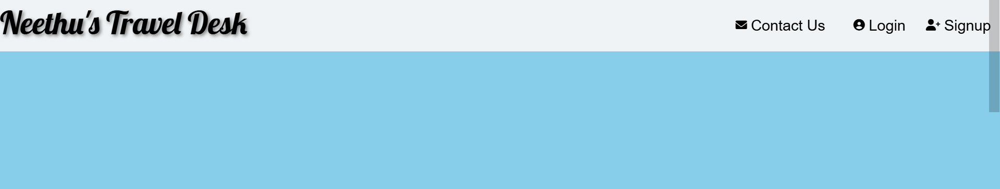
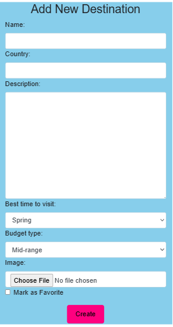

# Testing

This is the Testing section of the 
[README.md](README.md) file.It contains all the testing information for the project 
"Neethu's Travel Desk".

Return to [README.md](README.md)
## Table of contents

[Testing](#testing)
[Table of Contents](#table-of-contents)
+ [Testing User Stories](#testing-user-stories)
+ [Manual Testing](#manual-testing)
+ [Automated Testing](#automated-testing)
   - [Code validation](#code-validation)
   - [Lighthouse Validation](#lighthouse-validation)  
   - [Browser Validation](#browser-validation) 
+ [User Testing]()

[Back to Top ⇧](#table-of-contents)

### Testing User Stories
***
1. As a ***new user***, I want to ***be able to register for an account on the "Neethus Travel Desk" website***, so that I can ***log in with username or email, and password***.

- **Acceptance Criteria**
***Registration Form:***
- [x] There is a registration form accessible from the website's homepage.
- [x] The registration form includes fields for username, email address, password, and password confirmation.
- [x] Passwords are required to meet minimum default complexity requirements.
***Validation:***
- [x] Users are alerted with clear error messages if they submit incomplete or invalid data.
- [x] Users receive an error message if the chosen username is already in use.
- [x] Users receive an error message if the provided email address is already registered.
***Password Security:***
- [x] Passwords are securely hashed and salted before being stored in the database.
- [x] The system enforces password complexity requirements.
***User Data Storage:***
- [x] User data (username, hashed password, email, etc.) is stored securely in the database upon successful registration.
***User Feedback:***
- [x] Upon successful registration, the user receives a confirmation message.
- [ ] Optionally, an email confirmation link is sent to the user's provided email address.
***Login Functionality:***
- [x] After registration, users can log in using their username and password.
- [x] Users receive an error message if they enter incorrect login credentials.
***Session Management:***
- [x] User sessions are managed securely, allowing users to stay logged in until they choose to log out.

***

2. As a ***registered user***, I want to ***be able to edit my profile information***, so I can ***easily change a password, and a profile picture***.

- **Acceptance Criteria**

- [x] When logged in as a registered user, I should see an option to access my profile settings.
- [x]  Within the profile settings, I should see fields for editing my email, password, and uploading a new profile picture. If the profile picture field doesn't exist, I should see a placeholder image.
- [x] The password field should allow me to change my password with appropriate validation rules (e.g., minimum length, complexity requirements).
- [x] After making changes, I should be able to save my updated profile information.
- [x] Once saved, my profile information should reflect the changes on my user profile page.

***

3. As a ***registered user***, I want ***the option to delete my user profile*** so I can ***decide to leave the website***.

- **Acceptance Criteria**

- [x] When logged in as a registered user, I should see an option to access my account settings.
- [x] Within the account settings, there should be a clear and easily accessible option to delete my user profile.
- [x] Clicking the "Delete Profile" option should prompt me to confirm my decision.
- [x] After confirming, my user profile and all associated data should be permanently deleted.
- [x] Upon deletion, I should be logged out, and I should receive a confirmation message indicating that my profile has been deleted.

***

4. As a ***registered user***, I want to ***add a new destination to the website***, so that ***its details would be added to the database***.

- **Acceptance Criteria**

- [x] The user must be logged in as a registered user to access the "Add Destination" feature.
- [x] There should be a clearly visible option or button for adding a new destination on the website.
- [x] The user should be able to enter the following information for the destination: Name(mandatory), Country (mandatory), best_time_to_visit(mandatory),budget_type(mandatory),description(optional),is_favorite(optional), Image (optional).
- [x] The image upload should support common image formats (e.g., JPG, PNG) and have a file size limit. Invalid image formats or oversized images should be rejected with a clear error message.
- [x] After submitting the destination details, the destination should be saved in the database with a unique identifier.
- [x] The newly added destination should be displayed on the website immediately after submission.
- [x] The user should receive a confirmation message after successfully adding a destination.

***
[Back to top ⇧](#table-of-contents)

5. As a ***registered user***, I want to ***be able to update the the destinations I've added***, so I can ***correct the information of the record (name, country, image, description,best_time_to_visit,budget_type,is_favourite)***.

- **Acceptance Criteria**

- [x] The user must be logged in as a registered user to access the destination to  update feature.
- [x] There should be a visible and accessible option or button to edit/update a destination's information.
- [x] When the user clicks the edit/update option for a destination, they should be directed to a destination editing form.
- [x] The editing form should display the current information of the destination (name, country, image, description,best_time_to_visit,budget_type,is_favourite).
- [x] The user should be able to modify the name, country, image, description,best_time_to_visit,budget_type,is_favourite fields.
- [x] The form should have validation to ensure that required fields are not left empty.
- [x] The user should have the option to cancel the editing process and return to the destination details page without saving any changes.
- [x] Upon saving the changes, the destination's information (name, country, image, description,best_time_to_visit,budget_type,is_favourite) should be updated in the database.
- [x] A confirmation message should be displayed to the user after successfully updating the destination's information.

***

6. As a ***registered user***, I want to ***be able to delete destination details from my profile***, so it ***will no longer be accessible***.

- **Acceptance Criteria**

- [x] When I am logged in as a registered user and I navigate to my destinations, I should see a list of destinations associated with my profile.
- [x] Next to each destination entry in my profile, there should be 'Edit' and 'Delete' icons that I can click to initiate the destination deletion process.
- [x] When I click the "Delete" button for a specific detination, a confirmation dialog or prompt should appear to ensure that I want to delete the destination.
- [x] If I confirm the deletion, the destination details should be permanently removed from my profile and should no longer be visible.
- [x] After successfully deleting a destination, I should receive a confirmation message or notification indicating that the deletion was successful.
- [x] If I cancel the deletion from the confirmation dialog, the destination should remain on my profile, unchanged.
- [x] The deletion process should be quick and responsive, ensuring a smooth user experience.
- [x] The system should handle any errors gracefully and provide appropriate error messages if the deletion process fails for any reason.

***
7. As a ***registered user***, I want to ***be able to favorite a destination review*** so that I can ***keep track of my favorite destinations***.

- **Acceptance Criteria**
- [x] The user must be logged in to their registered account.
- [x] In search results there should be a  "Favourite" button/icon.
- [x] Clicking the "heart-shaped icon" should add the destination details to the user's list of favourite destinations.
- [x] Clicking the "Favourite" button/icon again should remove the destination presentation from the user's favorite destinations.
- [x] The user should see a visual indication (e.g., change in button color or icon) when a destination presentation is favorited.
- [x] The user should see a visual indication (e.g., change in button color or icon) when a destination presentation is unfavorite.
- [x] The favourite destination presentations should be stored and associated with the user's account.
- [x] The user should be able to easily access their list of favourite destinations from their user profile.
- [x] If the user unfavourites a destination presentation, it should be immediately removed from their favourite list.

***

8. As a ***registered user***, I want to ***see a list of all the destinations I've added to the website*** for ***easy reference***.

- **Acceptance Criteria**

- [x] User Authentication: The feature should only be accessible to registered users who are logged in.
- [x] Navigation: There should be a clear and easily accessible link or button in the user interface that takes the user to their list of added destinations.
- [x] Destination List Display: When the user accesses their list, they should see a clear and organized list of all the Destinations they have added to the website.
- [x] Each destination entry should display at least the destination name,country,image,best time to visit and budget.
- [x] Detail View: Users should be able to click on a destination in the list to view more details about that destination, including a description, and any other relevant information.
- [x] Edit and Delete Options: Users should be able to edit the information of a destination in their list.
- [x]  Users should also have the option to delete a destination from their list.
- [x] Responsive Design: The feature should be accessible and user-friendly on various devices and screen sizes (e.g., desktop, tablet, mobile).
- [x] Performance: The page should load reasonably quickly, even if the user has a large number of destinations in their list.

***

[Back to top ⇧](#table-of-contents)

9. As a ***nomad*** and a ***registered user***, I want to ***access a dedicated "Favourites" page***, so I can ***see all the destinations I've favorited in one place***.

- **Acceptance Criteria**

- [x] When I log in as a registered user, there should be a "Favourites" option visible in the home page.
- [x] Clicking on the "my Favourites" option should take me to a dedicated page that displays all the destinations I've marked as favorites.
- [x] On the "Favourites" page, I should see a clear and user-friendly list of the destinations I've favorited.
- [x] If I haven't marked any destinations as favorites yet, the page should display a friendly message indicating that my list is empty and encouraging me to explore and favorite destinations.
- [x] Each destination displayed on the "Favourites" page should have a button or link that allows me to remove it from my favourites list.
- [x] When I remove a destination from my favourites list, it should be immediately removed from the "Favourites" page without requiring a page refresh.
- [x] The "Favourites" page should be responsive and work well on both desktop and mobile devices.

***

10. As a ***nomad*** and a ***registered user***, I want to ***search for destinations on the website***, so that I can ***browse and discover new destinations added by all users on the website***.

- **Acceptance Criteria**

- [x] The website should have a search bar prominently displayed on the destinations page.
- [x] As a registered user, I should be able to access the search functionality without any issues.
- [x] When I type a search query into the search bar and press "Enter" or click the search button, the website should display a list of relevant destinations based on my query.
- [x] The search results should include destination name, country,description,best_time_to visit,budget of each destination.
- [x] Each search result should be clickable, allowing me to view more details about the destiation when I click on it.
- [x] The search functionality should be responsive and work well on both desktop and mobile devices.
- [x] The search should support basic search features such as partial matching 
- [x]  The search should make me able to favorite a certain destination.

***

11. As a ***registered user***, I want to ***be able to use a contact form***, so I can ***reach out to the website administrators with questions, feedback, or concerns***.

- **Acceptance Criteria**

- [x] The contact form should be accessible to registered users when they are logged in.
- [x] The contact form should have fields for the user to input their name, email address,phone number,and message.
- [x] There should be a "Submit" button to send the message to the website administrators.
- [x] Upon submitting the form, the user should receive a confirmation message indicating that their message has been sent successfully.
- [x] Website administrators should receive an email notification with the user's message, and contact information when a user submits the form.
- [x] Users should not be able to submit the form if any required fields are left blank.
Users should receive an error message if there are any issues with their submission (e.g., invalid email address,phone number) and should be prompted to correct the errors.
- [x] The contact form should be responsive and visually appealing on different devices (e.g., desktop, tablet, mobile).
- [x] The contact form should be accessible to users with disabilities, following WCAG guidelines.

***
12. As a ***nomad*** and a *** registered user***, I want to be able to like destinations so that I can engage with travel content in a fun and interactive way."
- **Acceptance Criteria**

- [x] The like button should be accessible to registered users when they are logged in.

[Back to top ⇧](#table-of-contents)

### Manual Testing
#### Common Elements Testing
Manual testing was conducted on the following elements that appear on every page:

- Navbar

- Footer

- Favicon

#### Functionalities testing
- Login

- Register

- Logout

- Profile Update

- Add Destination

- Edit Destination

- Delete Destination

- Search Destination

- Destination Details

- Favourites Destination

- Contact Page

## Automated Testing
### Code Validation
#### HTML Validation
The [W3C Markup Validator](https://validator.w3.org/) service was used to validate the `HTML`.

These are the results of the validation:
- Homepage

- Login page

- Register page

- Contact page

- Popular Destinations page

- Budget Calculator

- View Detail Destination 

- Profile View Validation

### Explanation of the Issue
While testing and validating my HTML pages, I encountered an IO Error: HTTP resource not retrievable. The error message indicated that the remote server returned an HTTP status of 404 (Not Found) for the following URL:

https://neethus-travel-c40ea47fdf43.herokuapp.com/accounts/profile_view

https://neethus-travel-c40ea47fdf43.herokuapp.com/accounts/update_profile

https://neethus-travel-c40ea47fdf43.herokuapp.com/destination/destination/create/

https://neethus-travel-c40ea47fdf43.herokuapp.com/destination/my-destinations/

https://neethus-travel-c40ea47fdf43.herokuapp.com/destination/my-favorites/
After investigating the issue
I identified the root cause and potential reasons for this error. Here’s a summary of my findings:

Root Cause
The 404 Not Found error occurs when the requested resource  does not exist on the server. This can happen due to one or more of the following reasons:

Missing URL Configuration:

The URL pattern for /accounts/profile_view is not defined in the Django urls.py file.

If the URL pattern is missing, Django cannot route the request to the appropriate view, resulting in a 404 error.

Incorrect URL Pattern:

The URL pattern for the profile_view might be defined incorrectly, causing Django to fail to match the requested URL.

View Not Implemented:

The profile_view function or class-based view might not be implemented in the views.py file, even if the URL pattern is defined.

Authentication Issues:

If the profile_view is protected by the @login_required decorator and the user is not authenticated, Django will redirect the request to the login page (/accounts/login/). If the login URL is not properly configured, this can also result in a 404 error.

Deployment Issues:

If the application is deployed on Heroku, there might be issues with the deployment process, such as missing migrations, incorrect environment variables, or static files not being collected.

Steps Taken to Investigate
To diagnose the issue, I performed the following steps:

Checked the URL Configuration:

Verified that the URL patterns are correctly defined in the urls.py file.

Reviewed the View Implementation:

Ensured that the profile_view function or class-based view is implemented in the views.py file.

Tested Locally:

Ran the application locally using the Django development server to confirm that the URLs works as expected.

Checked Authentication:

Verified that the @login_required decorator is correctly applied that the login URL is properly configured.

Reviewed Deployment Logs:

Checked the Heroku logs for any errors or warnings related to the deployment process.

Possible Solutions
Based on my investigation, here are the steps I plan to take to resolve the issue:

Define the Missing URL:

Add the URL pattern for  in the urls.py file if it is missing.

Implement the View:

Ensure that the profile_view function or class-based view is correctly implemented in the views.py file.

Fix Authentication Issues:

If the views are protected by the @login_required decorator, ensure that the login URL is properly configured and that users are redirected correctly.

Re-deploy the Application:

If the issue is related to deployment, re-deploy the application to Heroku after ensuring that all migrations are applied and static files are collected.

